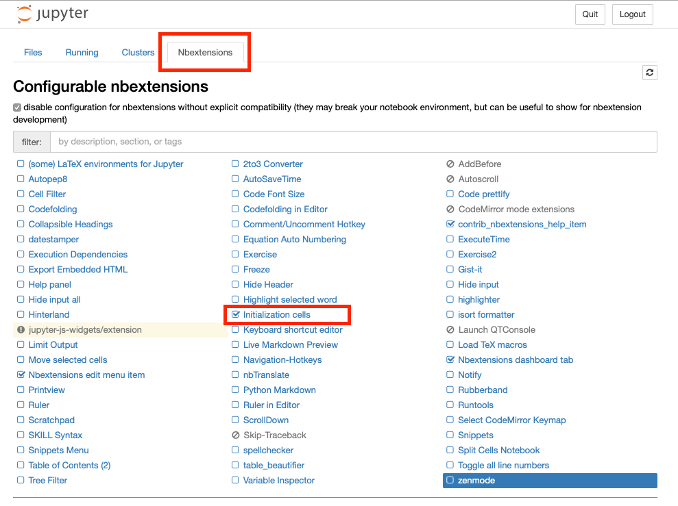

# DL-MSS

Deep Learning followed by Moment Scaling Spectrum

**Jupyter notebooks:**
* [Multiple State Generator](./MA_MultipleStateGenerator.ipynb) 
* [Data processing script](./MA_DataProcessing_UserFriendly_NEW.ipynb)

**Data files:**
* [Trained model](./Model_Bidirectional_NoShape_3state_Tr10000)
* [Model Parameters](./Parameters_Model_Bidirectional_NoShape_3state_Tr10000.txt)
* [tracks.simple.filtered.txt](./tracks.simple.filtered.txt) is an example text file with tracks (colunms correspond to "t x y track_id") that is used by [Data processing script](./MA_DataProcessing_UserFriendly_NEW.ipynb)

**Required python packages:**
* numpy
* scipy
* matplotlib
* seaborn
* ipywidgets

**Installation of 'ipywidgets' and enabling of 'Initialization cells':**

```python
pip install ipywidgets
jupyter nbextension enable --py widgetsnbextension

pip install jupyter_nbextensions_configurator jupyter_contrib_nbextensions
jupyter contrib nbextension install --user
jupyter nbextensions_configurator enable --user
```


In the Jupiter notebook, in the last tab “Nbextensions” the following extensions should be activated:
'Initialization cells':


